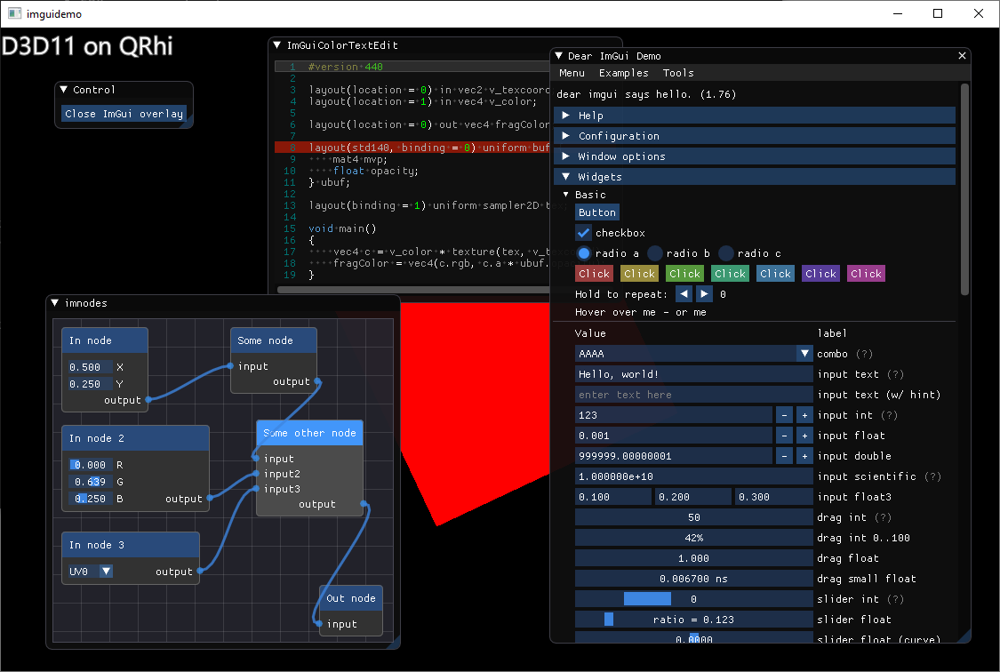

Modern examples of integrating [Dear ImGui](https://github.com/ocornut/imgui)
with [Qt Quick](http://doc.qt.io/qt-5/qtquick-index.html), serving both as a PoC
for integrating external engines (that do not render on its own but provide
vertex and image data) in Qt 6, and as a test bed to make experimenting with
ImGui and related 3rd party widgets simple and easy.

Here we use QRhi, the Qt Rendering Hardware Interface, to render. No direct
OpenGL usage anymore. QRhi is a private (but exported) API in the foreseeable
future, so the examples all pull in gui-private to get access to qrhi_p.h.

There are two demos at the moment, one targeting a QWindow (so no widgets, no
QML), and one as an overlay in a Qt Quick scene. The latter saves ~600 lines of
setup code because QQuickWindow takes care of all that.

When it comes to Qt Quick, this approach is different than what was taken in
[imgui-qtquick, an older OpenGL-based Qt 5 based
implementation](https://github.com/alpqr/imgui-qtquick). That one used
QSGRenderNode to get a true QQuickItem, while this one is an overlay that always
renders after Quick's done with recording the draw calls for the scene)

The Quick-based demo needs the 'dev' branch (so Qt 6.0) of qtbase and
qtdeclarative, and, at the time of writing, an additional [patch on
top](https://codereview.qt-project.org/c/qt/qtdeclarative/+/302460)

